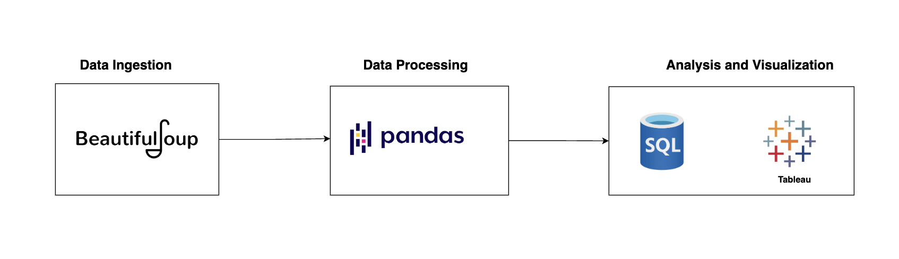

# JobAnalysis

## Project Overview

**JobAnalysis** is a data-driven project that analyzes job postings in the **data field**, including roles such as **Data Scientist, Data Analyst, and Data Engineer**. The project involves **web scraping, data processing with Pandas, SQL-based analysis, and Tableau visualizations** to uncover insights about job trends, salaries, employment types, and company hiring patterns.

## Project Pipeline

## Data Collection

The data was collected using **BeautifulSoup**, a Python library for web scraping. The extracted job-related information includes:

- **Job Title** (e.g., Data Scientist, Data Analyst, Data Engineer)
- **Job Description**
- **Seniority Level** (Entry-level, Mid-level, Senior)
- **Employment Type** (Full-time, Part-time, Contract)
- **Company Name**
- **Location**
- **Time Posted**
- **Number of Applicants**
- **Job Link** (URL to the job posting)
- **Salary Range**

## Data Processing

After web scraping, the raw data was processed using **Pandas** to clean and prepare it for analysis. The key processing steps included:

- **Handling Missing and Duplicate Data**:

  - **Null values** were removed to ensure data completeness.
  - **Duplicate job postings** were identified and removed to avoid redundancy.
  - **Inappropriate rows** (e.g., irrelevant job postings) were filtered out.

- **Standardizing Job Titles**:

  - The focus is on roles related to **Data Analyst, Data Scientist, Data Engineer, Data Analytics, and Data Entry**.
  - Job titles containing these keywords (with variations) were standardized to their respective roles to maintain consistency in the analysis.

- **Processing Salary Data**:

  - The salary data was initially in a **range format**. For analysis, the values were split into two separate columns: **min_salary** and **max_salary**.
  - Salary values included both **annual and hourly rates**. To standardize them, **hourly rates were converted to annual salaries** by multiplying the hourly rate by **40 hours per week** and **52 weeks per year**. This conversion was applied to both **min_salary** and **max_salary**.

- **Ensuring Proper Data Types**:

  - Data types were converted to the **appropriate formats** (e.g., salary columns as integers, date columns as datetime, and categorical values as strings) for efficient querying and analysis.

- **Cleaning the Number of Applicants Column**:

  - The **num_applicants** column contained text along with numeric values (e.g., "15 applicants").
  - The text **"applicants"** was removed, leaving only numeric values, which were converted to **integers**.
  - Rows with missing values were set to **0**.

- **Creating State-Based Job Analysis**:
  - A new column, **state_abbr**, was created by extracting the **state abbreviation** from the **location** column to allow for state-based job distribution analysis.

## Data Analysis

After importing the cleaned data into **SQLiteStudio**, various SQL queries were performed to extract valuable insights. The analysis focused on understanding the distribution of **job postings**, **applicants**, **employment types**, **companies**, **states**, and **salaries** within the **data-related roles**. Key insights extracted from the data include:

1. **Total Number of Job Postings**:  
   The total number of job postings across all companies and locations.

2. **Total Number of Applicants**:  
   The cumulative number of applicants for all job postings, providing insights into the overall demand for data-related roles.

3. **Top 5 Job Titles with the Highest Number of Job Postings**:  
   Identifying the most commonly posted job titles within the **Data Analyst, Data Scientist, and Data Engineer** roles.

4. **Distribution of Employment Types for Data Scientist, Data Analyst, and Data Engineer Roles**:  
   Analyzing the distribution of **full-time, part-time,** and **contract** roles within the selected job titles to understand the employment preferences.

5. **Companies with the Highest Number of Job Postings**:  
   Finding the companies that are hiring the most for data-related roles and understanding how the job postings are distributed across the **top 10 companies**.

6. **State-wise Distribution of Job Postings**:  
   Identifying which states have the highest number of job postings for **Data Scientist, Data Analyst, and Data Engineer** roles and analyzing the geographical distribution of job opportunities.

7. **Average Salary for Different Seniority Levels Among Data Scientist, Data Analyst, and Data Engineer Roles**:  
   Calculating the average salary for each **seniority level** (Entry-level, Mid-level, Senior) within the three data-related roles, providing insights into compensation trends.

These analyses were performed using structured **SQL queries**, and the results were visualized and explored further using **Tableau** for better insights.

## Data Visualization with Tableau

After performing the data analysis, **Tableau** was used to create interactive visualizations for deeper insights. The key insights derived from the visualizations include:

### Key Insights:

1. **Most Popular Job Titles**:  
   The **Data Scientist**, **Data Analyst**, and **Data Engineer** roles are the most popular in terms of job postings, consistently appearing as the top job titles across the dataset.

2. **Employment Type Distribution**:  
   Most of the job postings for the top three roles (**Data Scientist, Data Engineer**, and **Data Entry**) are **full-time positions**, highlighting the demand for stable, long-term employment in these fields.

3. **Top 10 Companies by Job Openings**:  
   The company with the highest number of job postings is **Talentify.io**, with a total of **18 job openings**. Other notable companies with significant job postings include:

   - **T-Mobile**
   - **SynergisticIT**
   - **Arrow Search Partners**  
     These companies have around **15 job openings** each, with Talentify.io standing out as the leader.

4. **State-wise Distribution of Job Openings**:

   - **California** has the highest number of job postings for data-related roles, followed by:
   - **Texas**
   - **New York**  
     These states dominate the job market for data professionals, offering the most opportunities.

5. **Salary Trends Across Seniority Levels**:  
   The salary trends show a clear hierarchy based on **seniority levels**:
   - **Executive**: The highest median salary at **$200,000**.
   - **Director**: Slightly lower with a median of **$188,750**.
   - **Associate**: Entry-level roles with the lowest median salary starting at **$107,000**, reflecting the starting salaries in the data job market.

You can access the Tableau dashboard via the link below:  
[**JobAnalysis Tableau Dashboard**](https://public.tableau.com/app/profile/bikram.chand/viz/JobAnalysis_17392143404470/Dashboard1)
